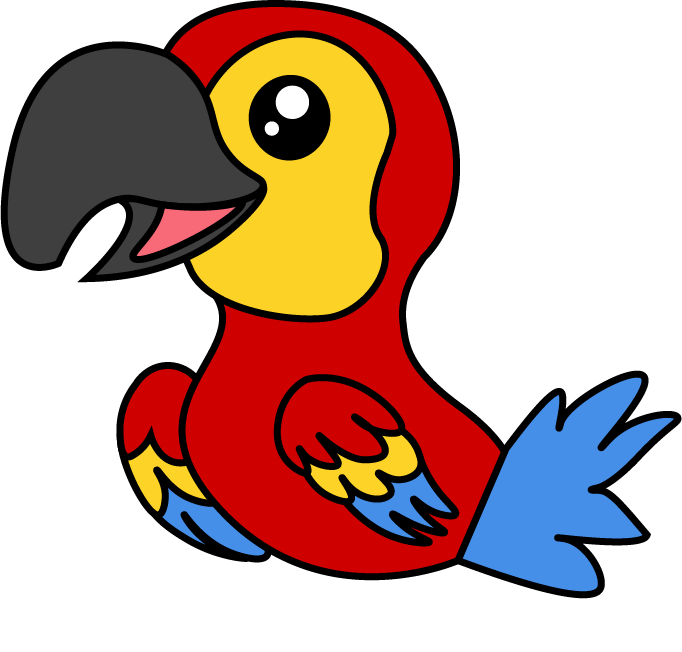

 

    

Main repository for the Parrot commit assistant. 

### 🔌 Plugins for IDEs
+ [Parrot for IntellJ](https://github.com/mamiksik/parrot-intellij)
+ [Parrot for VSCode](https://github.com/mamiksik/parrot-vscode)

### 🦾 Trained Models
+ [Parrot commit generation Model](https://huggingface.co/mamiksik/CommitPredictorT5PL)
+ [Parrot autocomplete model](https://huggingface.co/mamiksik/CodeBERTa-commit-message-autocomplete)

### 📚 Others
- [Parrot Dataset](https://huggingface.co/datasets/mamiksik/processed-commit-diffs)
- [Parrot Inference Server](https://github.com/mamiksik/ParrotInferenceServer)